# Exploratory Data Analysis with Python

## Introduction
This is an exploratory data analysis of Spotify dataset. The dataset comprises of songs published on the platform from 1922 to 2021. The two datasets used for the demo are gotten from kaggle.com and are classified as [Spotify tracks](https://www.kaggle.com/datasets/zaheenhamidani/ultimate-spotify-tracks-db) (features of tracks) and [Soptify datasets](https://www.kaggle.com/datasets/lehaknarnauli/spotify-datasets) (classification by Genre).

Spotify is an audio streaming and media service provider founded in 2006 by Daniel Ek and Martin Lorentzon. It has over 433 million monthly active users, including 188 million subscribers as of June 2022 with total revenue of 9.668 billion euros and total asset of 7.170 billion euros. As of June 2022, Spotify has 9,058 total employees with the total number of downloads exceeding 1 billion in May, 2021 and currently the official sponsors of FC Barcelona of Spain (both male and female football team). Millions of people listen to music worldwide, it’s valuable to explore and quantify data about music and drawing important insight.

## Scope and Limitation

Only the exploratory data analysis was done using python libaries such as NumPy, Pandas, Matplotlib, and Seaborn. Jupyter notebook was used for this project.

### Exploring the data

Numpy, Pandas, matplotlib.pyplot and seaborn are the necessary libraries for this demo. The spotify tracks dataset was loaded using the code as shown below:

spotify_tracks = pd.read_csv('C:\\Users\\Admi\\Documents\\My Documents\\tracks.csv')
spotify_tracks.head()

The first five rows was printed as shown below

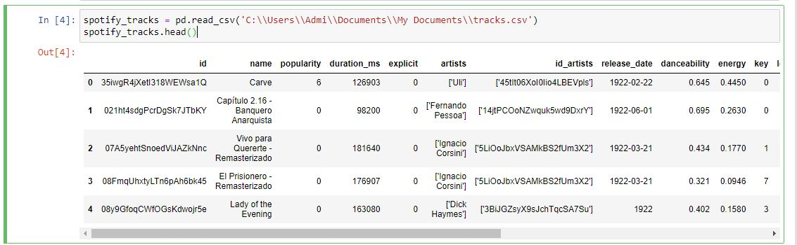

Since the dataset was downloaded from an open repository, there are chances the dataset contain null values it is a good practice to always check null values in dataset. The pandas library made work easy for us by using the .isnull() function on the dataset. The .sum() function calculate the total sum of null values in each colunms.

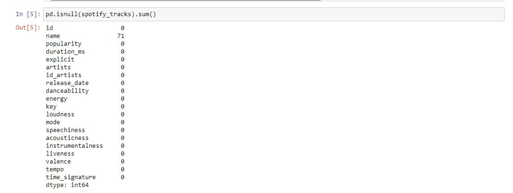

The .info() methods gives us the total number of rows and columns in the dataset and the memory usage.

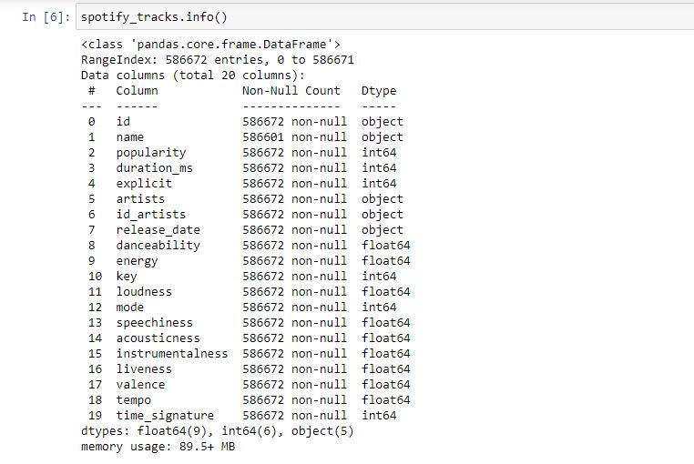

### Analysis

Here comes the first analysis, finding the top most popular songs in spotify from 1922 to 2021. This was achieved by using the .sort_values() methods, passing popularity and setting ascending to be false will define the sorting. Top least popular songs can be achieved using the same code by changing ascending=True

sorted_popularity = spotify_tracks.sort_values("popularity", ascending = False).head(3)
sorted_df
the .head methods narrows the sorting top 3

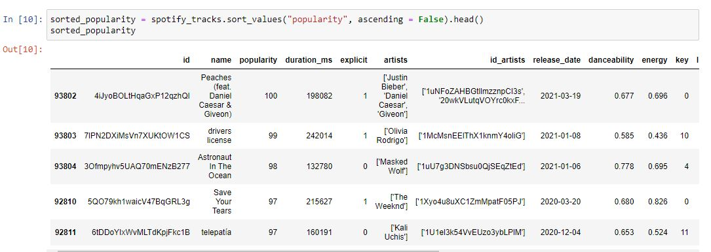

The .describe() methods gives the descriptive statistics of the data which include the count, mean, standard deciation, 50th percetile (median) etc

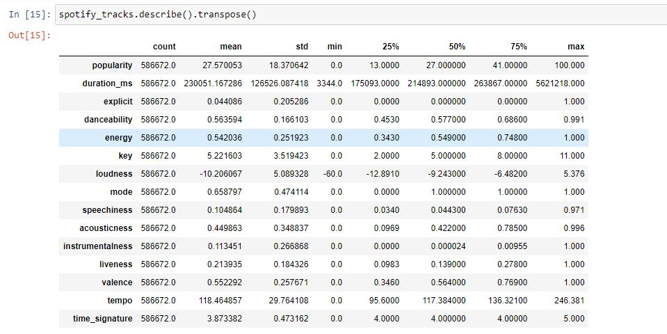

The songs with more than 90 popularity was checked using .query function from pandas and pass ‘popularity >90’, inplace=False (so the the original data frame will be intact) and again using the .sort_values we used earlier.

most_popular = spotify_tracks.query('popularity>95', inplace=False).sort_values('popularity', ascending = False) 
most_popular[:5]

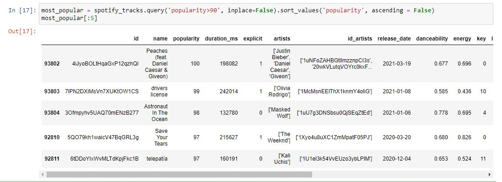

The index of the dataset was changed from number to release date. By doing so the dataset frame was changed using inplace=True.

spotify_tracks.index= pd.to_datetime(df_tracks.index)

spotify_tracks.head()

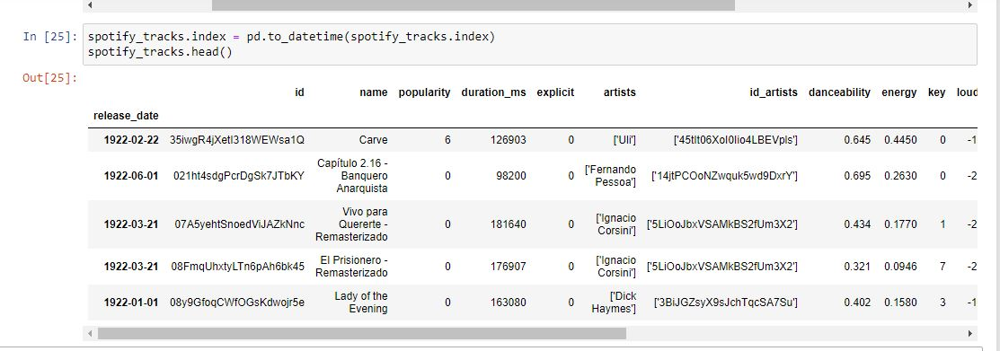

The .iloc function was used to locate the 18th artist.

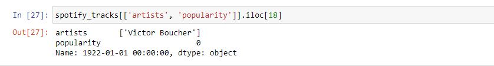

The duration of the tracks are all in milliseconds, it was converted to seconds for readability and easy understanding.

spotify_tracks['duration'] = spotify_tracks['duration_ms'].apply(lambda x: round(x/1000))
spotify_tracks.drop('duration_ms', inplace= True, axis = 1)
spotify_tracks.duration.head()

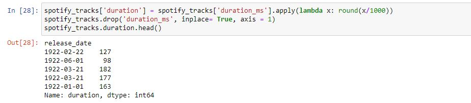

The first visualization is the correlation heat map, pearson correlation was used to draw three unmounted columns between key mode and explicit setting the figure size at (14,6).

corr_df = df_tracks.drop(['key', 'mode', 'explicit'], axis = 1).corr(method="pearson")
plt.figure(figsize=(14,6))
heatmap = sns.heatmap(corr_df, annot=True, fmt=".1g", vmin=-1, vmax=1, center=0, cmap='inferno', linewidths = 1, linecolor = "Black")
heatmap.set_title("Spotify Correlation HeatMap ")
heatmap.set_xticklabels(heatmap.get_xticklabels(), rotation = 90)

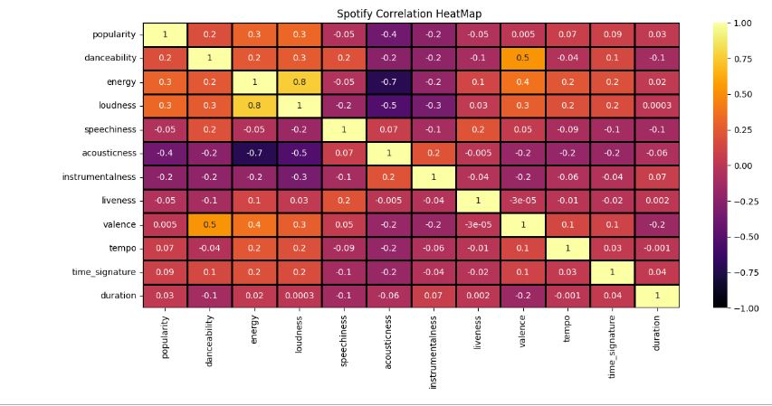

The scale was set from -1 to +1 (from a negative or least correlation to positive or high correlation at +1) there is a positive correlation between energy and loundness of songs with the value of 0.8, this means if the song is loud the energy will increase. There is negative correlation between acousticness and danceability, a positive correlation between between energy and valence and so on.

Sample of the dataset was taken, this was done by taking 0.4% of the original dataset.

sample_track= spotify_tracks.sample(int(0.004*len(spotify_tracks)))
print(sample_track)
The sample dataset will contains 2346 rows

### Relationship between loudness and energy
The relationship between loudness and energy using regression line

plt.figure(figsize=(10,6))
sns.regplot(data = sample_df, y = "loudness", x = "energy", color = "c").set(title = "Loudness Vs Energy reg correlation")

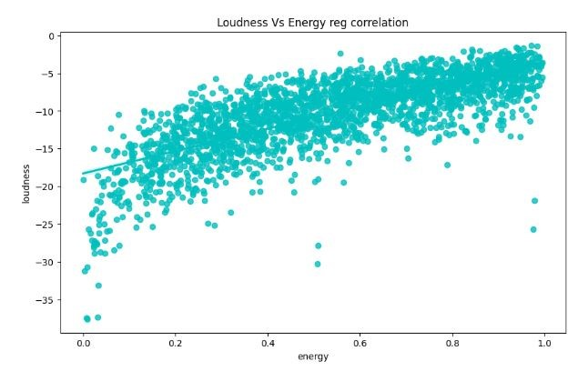

To know the total number of songs realeased per year from 1922 to 2021 that are available in spotify we use the histogram plot. But we need to create a new column that will contain only the year, the code below will achieve that
spotify_tracks['release_date'] = pd.to_datetime(spotify_tracks['release_date'])
year = spotify_tracks['release_date'].dt.year
we now plot the histogram 
sns.displot(years, discrete=True, aspect=2,height=5, kind="hist").set(title="Number of songs per year")

In the 1920s there are limited number of songs, the number increased exponencially towards the beginning of 2000
We will now see the duration of songs over years usuing bar plot
total_duration = df_tracks.duration
fig_dims = (18,7)
fig, ax = plt.subplots(figsize=fig_dims)
fig = sns.barplot(x=years, y=total_duration , ax = ax, errwidth = False).set(title = 'Year Vs duration')
plt.xticks(rotation = 90)

A line plot can also be used to see the relationship between the duration of songs and year released using the code
total_duration = df_tracks.iduration
sns.set_style(style="whitegrid")
fig_dims = (10,5)
fig, ax = plt.subplots(figsize=fig_dims)
fig = sns.lineplot(x=years, y=total_duration , ax = ax).set(title = 'Year Vs duration')
plt.xticks(rotation = 60)

