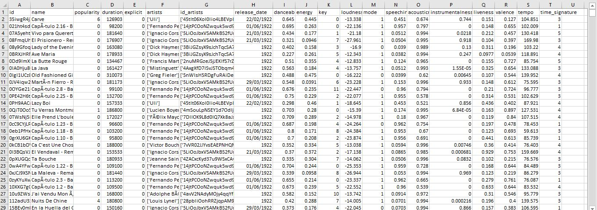

# Exploratory Data Analysis with Python

## Introduction
This is an exploratory data analysis of Spotify dataset. The dataset comprises of songs published on the platform from 1922 to 2021. The two datasets used for the demo are gotten from kaggle.com and are classified as [Spotify tracks](https://www.kaggle.com/datasets/zaheenhamidani/ultimate-spotify-tracks-db) (features of tracks) and [Soptify datasets](https://www.kaggle.com/datasets/lehaknarnauli/spotify-datasets) (classification by Genre).

Spotify is an audio streaming and media service provider founded in 2006 by Daniel Ek and Martin Lorentzon. It has over 433 million monthly active users, including 188 million subscribers as of June 2022 with total revenue of 9.668 billion euros and total asset of 7.170 billion euros. As of June 2022, Spotify has 9,058 total employees with the total number of downloads exceeding 1 billion in May, 2021 and currently the official sponsors of FC Barcelona of Spain (both male and female football team). Millions of people listen to music worldwide, it’s valuable to explore and quantify data about music and drawing important insight.

## Scope and Limitation

Only the exploratory data analysis was done. It is assume that reader have basic python programming knowledge with include: the basic Python operations, NumPy, Pandas, Matplotlib, and Seaborn. Jupyter notebook was used for this project.

### Exploring the data

The tow
